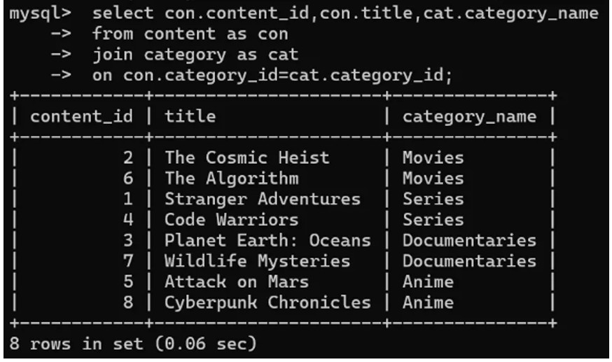
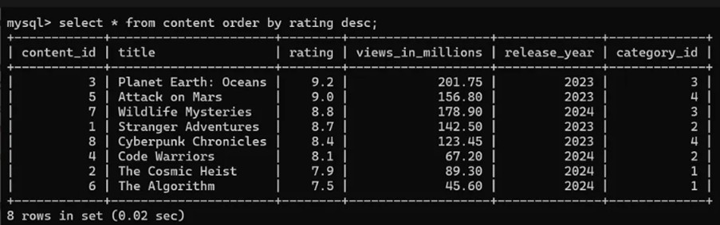
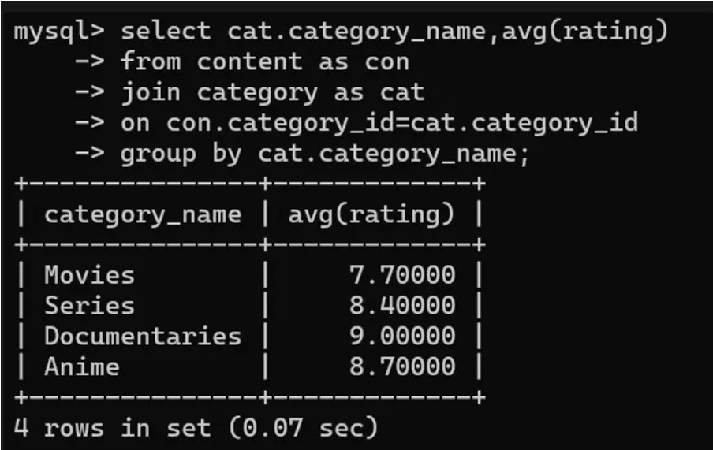
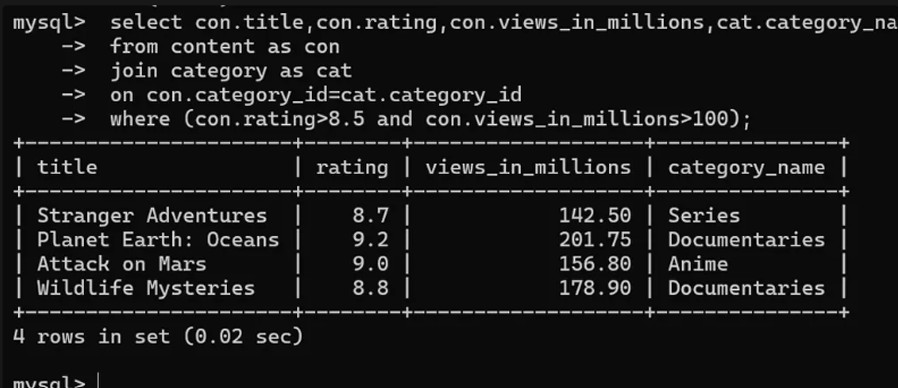
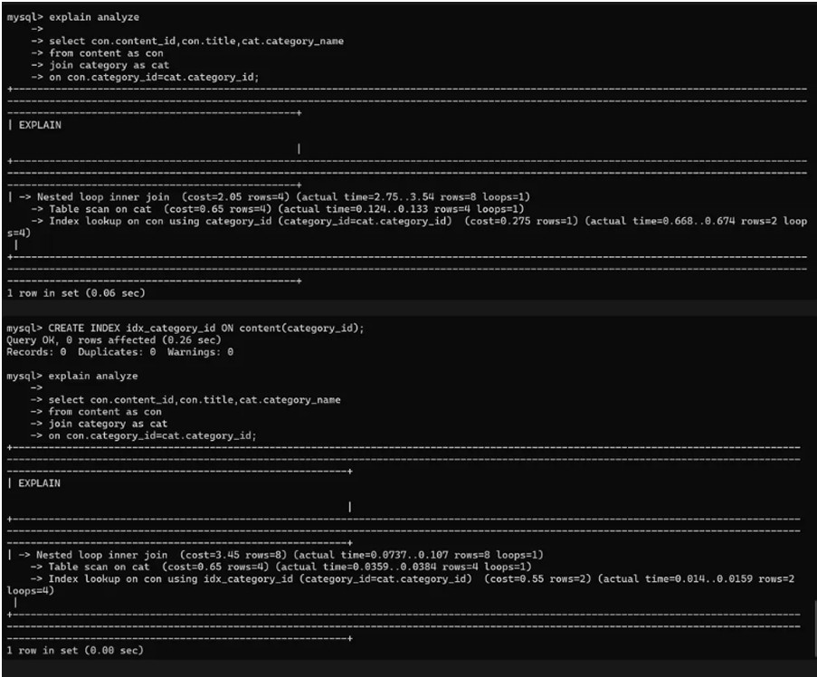

Database Assignment answers 
Q1) 
select con.content_id,con.title,cat.category_name 
from content as con  
join category as cat  
on con.category_id=cat.category_id; 

Q2)select * from content order by rating desc; 

Q3) 
select cat.category_name,avg(rating) 
from content as con  
join category as cat  
on con.category_id=cat.category_id  
group by cat.category_name; 

Q4) 
select con.title,con.rating,con.views_in_millions,cat.category_name 
from content as con  
join category as cat  
on con.category_id=cat.category_id  
where (con.rating>8.5 and con.views_in_millions>100); 

Q5) 
After creating the index the query became faster as we can see instead of scanning the 
entire table it now uses the index created to find the matching rows faster. 

Why #1: Why do we use Foreign Keys? 
We use foreign keys to make sure the referencing table cannot add invalid data.Say user_id 
in table B is a foreign key referencing the user_id (primary key) in table A.Adding a user_id 
in table B which is not present in table A would not make sense and lead to 
inconsistency.Therefore, we use foreign keys. 

Why #2: Why is ACID important for this database? 
If 1000 users watch “Stranger Adventures” at the same time and the system keeps updating 
the view count, if we do not use ACID properties the view count might become incorrect as 
some updates might be lost (lack of consistency and atomicity) or overwritten(lack of 
isolation).Apart from that the entire data might get lost if the database is not durable.Thus,we 
need to make sure that the database follows ACID properties so the final view count is 
accurate, consistent, and never corrupted, even under heavy traffic. 

Why #3: Why would we create an index on category_id? 
When StreamFlix homepage loads, it runs hundreds of queries filtering by category.This 
means that speed of fetching this data is important.. If the StreamFlix database was small 
then scanning the entire table would not take a lot of time but for huge databases this would 
be very slow.By creating an index on category_id, the database no longer needs to scan the 
whole table. It can directly find the matching records, which makes the site faster and more 
efficient.